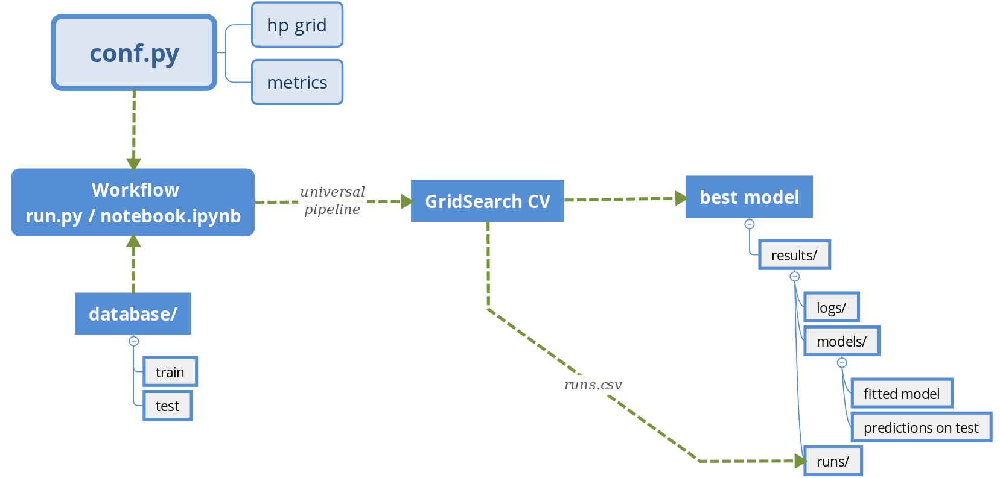
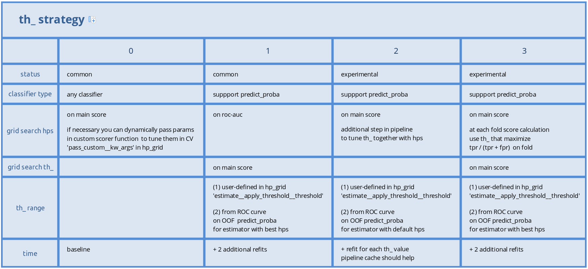
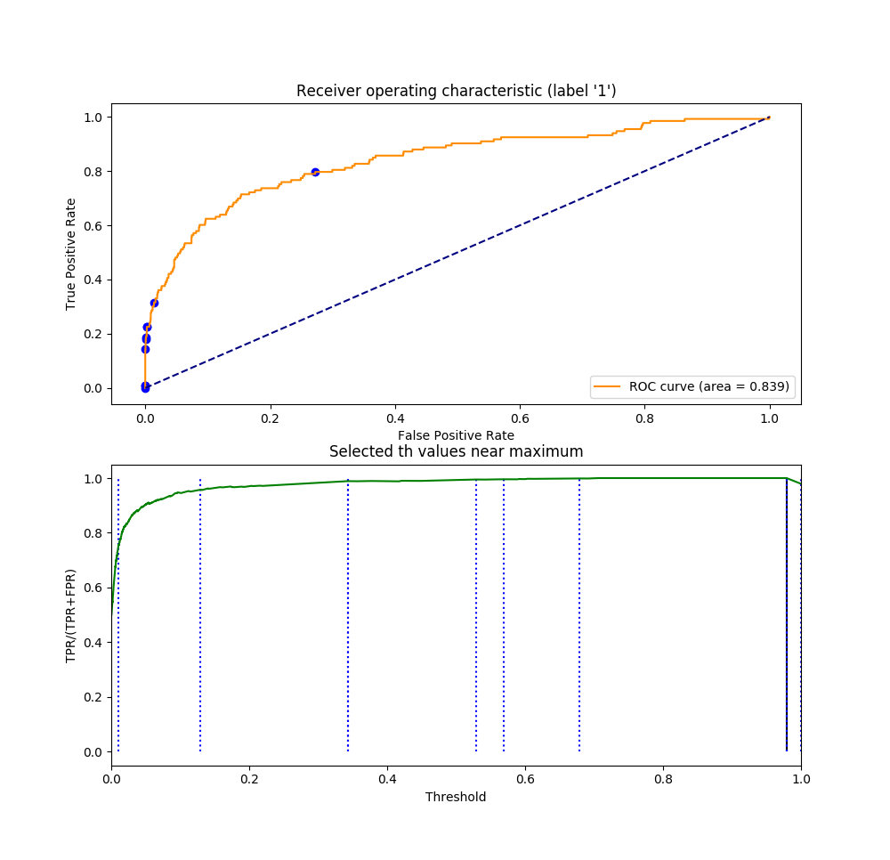

Concepts
========

.. contents:: **Contents**
    :depth: 1
    :local:
    :backlinks: none

Pipeline structure
^^^^^^^^^^^^^^^^^^

- Unified pipeline based on sklearn.Pipeline.
- Data scientist can use it for broad range of tasks with minimal changes in code.
- It provides stable cross-validation scheme and prevents data leaks.
- Every parameter at each step can be tuned in GS CV.

Embedded universal pipeline for grid search:

.. code-block:: none

    default_steps = [
        ('pass_custom',      pass custom params to custom scorer while grid search)
        ('select_rows',      delete rows (outliers/anomalies))
        ('process_parallel',
            ('pipeline_categoric',
               ('select_columns',      select categorical(and binary) subcolumns)
               ('encode_onehot',       OneHot encoder)
            )
            ('pipeline_numeric',
                ('select_columns',     select numeric subcolumns)
                ('impute',
                    ('indicators',     impute indicators)
                    ('gaps',           impute gaps)
                )
                ('transform_normal',   yeo-johnson features transforamtion)
                ('scale_row_wise',     row_wise transformation)
                ('scale_column_wise',  column_wise transformation)
                ('add_polynomial',     add polynomial features)
                ('compose_columns',
                    ("discretize",     discretize columns)
                )
            )
        )
        ('select_columns',   model-wise feature selection)
        ('reduce_dimension', Factor analyze feature selection/transformation)
        ('estimate',         target transform)
    ]

See `CreateDefaultPipeline <_modules/mlshell/default.html#CreateDefaultPipeline>`_ source for details.

By default only OneHot encoder and imputer (gaps and indicators) are activated.
Set corresponding parameters in conf.py hp_grid dictionary to overwrite default.

.. note::

    | If necessary, you can redefine pipeline in conf.py by specifying ``pipeline__steps`` parameter.
    | It can be either list of sklearn.pipeline.Pipeline steps or class like ``CreateDefaultPipeline``:
    | Method .get_steps() will be called from Workflow class.
    | Init method  ``.__init__(categoric_ind_name, numeric_ind_name, params)`` should take:

        * | categoric_ind_name(dict): {column_index: ('feature_categor__name',['B','A','C']),}
          |   keys: index of categorical columns in input dataframe.
          |   values: tuple(column's name, raw categories' names).

        * | numeric_ind_name (dict):  {column_index: ('feature__name',),}
          |   keys: index of numerica column in input dataframe.
          |   values: (column's name).

        * params (dict): user-defined conf.py parameters, see `DEFAULT_PARAMS <./mlshell.html#mlshell.default.default_params>`__.

Data requirements
^^^^^^^^^^^^^^^^^

Engineer have to write:

* data wrapper from database.
* data preprocessor to prepare dataframe for Workflow class.

.. note::

    dataframe should have columns={``targets``, ``feature_<name>``, ``feature_categor_<name>``}

    * ``feature_categor_<name>``: any dtype.

        order is not important (include binary).

    * ``feature_<name>``: any numeric dtype (should support float(val): np.issubdtype(type(val), np.number))

        order is important.

    * ``targets``: any dtype.

        | for classification ``targets`` should be binary, ordinalencoded.
        | positive label should be > others when np.unique(``targets``) sort.

    Most often wrapper/preprocessor classes from `Examples <Examples.html>`_ with minimal changes will be sufficient.

Data unification
^^^^^^^^^^^^^^^^

Before pass to pipeline input data need to unified with ``Workflow.unify_data()`` method.

Internally:

- categorical features are OrdinalEncoded.
- categorical gaps are imputed with .fillna(value='unknown').
- numeric gaps are imputed with .fillna(value=np.nan).
- dataframe is casted to .astype(np.float64).

Configuration file example
^^^^^^^^^^^^^^^^^^^^^^^^^^

| Data scientist can set all workflow parameters through one configuration file ``conf.py``.
| Typically ``conf.py`` should specify:

- last step estimator and its type.
- train-validation split ratio.
- metrics to evaluate on validation data.
- grid search parameters ``hp_grid`` and cross-validation splitter.
- arguments passed to data wrapper.

.. code-block:: python

    params = {
        'pipeline': {
            'estimator': estimator,
            'type': 'regressor',
        },
        'metrics': {
            'score': (sklearn.metrics.roc_auc_score, {'greater_is_better': True, 'needs_proba': True}),
            'custom': (custom_score_metric, {'greater_is_better': True, 'needs_custom_kw_args': True}),
            'confusion matrix': (sklearn.metrics.confusion_matrix, {'labels': [1, 0]}),
        },
        'gs': {
            'flag': True,
            'splitter': sklearn.model_selection.KFold(n_splits=3, shuffle=True),
            'hp_grid': hp_grid,
            'metrics' ['score', 'custom']
        },
        'data': {
            'split_train_size': 0.75,
            'train': {
                'args': ['data/train.csv'],
                'kw_args': {},
            },
            'test': {
                'args': ['data/test.csv'],
                'kw_args': {},
            },
        },
        # classification only
        'th': {
            'pos_label': 1,
            'strategy': 1,
            'samples': 10,
            'plot_flag': True,
        },
        'seed': 42,
    }

see `default params <Default-configuration.html#mlshell.default.DEFAULT_PARAMS>`_ for full list.

.. note::

    Internally, params are converted to flat {'key__subkey':val}.

    Ramdom state is controlled by 'seed' parameter (both random.seed() and np.random.seed()).

Split
^^^^^

- ``train`` data will be split on ``subtrain`` and ``validation`` datasets by sklearn.model_selection.train_test_split with ``split_train_size`` proportion.
- ``subtrain`` will be used in gs cross-validation with ``splitter``.
- ``validation`` will be used to evaluate metrics on best model from gs.
- If ``split_train_size`` = 1, gs use whole dataset and ``validation`` = ``train`` for compatibility.

Metrics
^^^^^^^

| Specify metrics in ``metrics`` dictionary, which will be used for validation.
| Metric dict value should contain tuple/list with at most two entity:

    * 0 index: metric callback or str (sklearn built-in names)
    * 1 index: make_scorer and metric function kwargs.

Hyperparameters grid
^^^^^^^^^^^^^^^^^^^^

- Each parameter(hp) at every pipeline step can be tuned in GS.
- Set one value for parameter to overwrite default.
- Set multiple values to proceed GS on that parameter.

.. code-block:: python

    hp_grid = {
        # custom scorer param
        'pass_custom__kw_args': [{'param_a': 1, 'param_b': 'c'}, {'param_a': 2, 'param_b': 'd'},],
        # transformers param
        'select_rows__kw_args': [{}],
        'process_parallel__pipeline_numeric__impute__gaps__strategy': ['constant'],
        'process_parallel__pipeline_numeric__transform_normal__skip': [True],
        'process_parallel__pipeline_numeric__scale_column_wise__quantile_range': [(1, 100)],
        'process_parallel__pipeline_numeric__add_polynomial__degree': [3],
        'process_parallel__pipeline_numeric__compose_columns__discretize__n_bins': [5],
        'select_columns__estimator__skip': [True],
        'reduce_dimension__skip': [True],
        # regressor only
        'estimate__transformer': [None, sklearn.preprocessing.FunctionTransformer(func=np.log, inverse_func=np.exp)],
        # estimator params
        'estimate__regressor__n_estimators': np.linspace(50, 500, 10, dtype=int),
        'estimate__regressor__num_leaves' :[2 ** i for i in range(1, 6 + 1)],
        'estimate__classifier__min_child_samples': np.linspace(1, 100, 10, dtype=int),
        'estimate__regressor__max_depth': np.linspace(1, 10, 10, dtype=int),
        # classifier only
        'estimate__apply_threshold__threshold': [0.1],
    }

.. note::

    Probaility distribution for ``hp_grid`` params are also possible, should have .rvs() sampling method.

    ``estimate__transformer`` is applied only to regressors for target transformation, ignored if classifier.
    Should be the last in pipeline.

    ``estimate__apply_threshold__threshold`` id applied only to classifier for threshold tuning (default = 0.5).
    Inserted in the end of pipeline automatically.

    ``pass_custom__kw_args`` is applied when need to pass custom parameters to custom scorer function while grid search.
    So we can tune arbitrary hyperparameters.
    If used, should be the first step in pipeline.
    Specify specify {'needs_custom_kw_args': True} in ``metrics`` for custom metric`s , so custom params will be passed
    in metric` kw_args while grid search.

    .. code-block:: python

        # classifier custom metric example
        def custom_score_metric(y_true, y_pred, **kwargs):
            """Custom precision metric."""
            if kwargs:
                # some logic.
                # pass_custom_kw_args are passed here.
                pass
            tp = np.count_nonzero((y_true == 1) & (y_pred == 1))
            fp = np.count_nonzero((y_true == 0) & (y_pred == 1))
            score = tp/(fp+tp) if tp+fp != 0 else 0
            return score

.. .. warning::
    Set ``seed`` None, if use sampling from distribution for any parameter.

Grid Search
^^^^^^^^^^^
* if ``gs__flag`` is True:

    | Will run gridsearch(GS) and fit estimator with the best parameters.
    | sklearn.model_selection.RandomizedSearchCV is used by default.

    | Metric name in ``refit`` will be used for best model selection in grid search.
    | This name should be one from global ``metrics`` key.
    | ``gs`` has its own `metrics`` subkey, where you can specify metrics name appropriate for grid search.
    | It can subset of global ``metrics`` or sklearn built-in metrics names.

* else:

    | If any param specified in hp_grid with sequence:
    | pipeline will be fitted with the value on the zero position of parameter range, otherwise  default value.

| Internally hps are optimized sklearn.model_selection.RandomizedSearchCV(
|   pipeline, ``hp_grid`` scoring=scorers, **params['gs']).fit(x_subtrain, y_subtrain, ** ``pipeline__fit_params``)

.. note::

    Scorers are generally made from ``gs__metrics`` (see `below <Concepts.html#classification-threshold>`_ for special cases).

    | If ``gs__n_iter`` is None, there will be as much runs as hps combinations defined in hp_grid.
    | If any of the params specified in ``hp_grid`` with distribution: ``gs__n_iter`` should be specified as int.

    | The ``n_jobs`` control number of parallel CV, and dataset is copied in RAM pre_dispatch times.
    | pre_dispatch = max(1, ``n_jobs``) if ``n_jobs`` else 1 (spawn jobs in advance for faster queueing)
    | If ``n_jobs`` = -1, dataset is copied in RAM hp-combinations times (ignores pre_dispatch limit).

Classification threshold
^^^^^^^^^^^^^^^^^^^^^^^^^

For classification task it is possible to tune classification threshold ``th_`` on CV.
If positive class probability P(positive label) = 1 - P(negative label) > ``th_`` for some sample,
classifier set pos_label for this sample, otherwise negative_label.

Built-in last step configuration for classifiers:

.. code-block:: python

    import mlshell

    pipe = sklearn.pipeline.Pipeline([
        ('estimate', sklearn.pipeline.Pipeline([
            ('classifier', mlshell.custom.PredictionTransformer(estimator)),
            ('apply_threshold', mlshell.custom.ThresholdClassifier(n_classes, pos_label_ind, pos_label, neg_label, threshold=0.5)),
        ]))
    ])

In general,

    * we can consider ``th_`` as hp,
    * each fold in CV has it own best ``th_``, we try to find value good for all folds,
    * ``th_`` search range can be got from ROC curve on classifier`s predict_proba.

Mlshell support multiple strategy for ``th_`` tuning:

.. note::

    (0) Don't use ``th_`` (common case).

        * Not all classificator provide predict_proba (SVM).
        * We can use f1, logloss metrics.
        * If necessary you can dynamically pass params in custom scorer function to tune them in CV (through 'pass_custom__kw_args' step in hp_grid).

    (1) First GS best hps with CV, then GS best ``th_`` (common).

        * For GS hps by default used auc-roc as score.
        * For GS ``th_`` used main score.
        * ``th_`` range should be unknown in advance:

            (1.1) set in arbitrary in hp_grid.

            (2.2) take typical values from ROC curve on OOF predicted with best hps.

    (2) Use additional step in pipeline (meta-estimator) to GS ``th_`` in predefined range (experimental).

        * Tune ``th_`` on a par with other hps.
        * ``th_`` range should be unknown in advance:

            (2.1) set in arbitrary in hp_grid.

            (2.2) take typical values from ROC curve on OOF predicted with default hps.

    (3) While GS best hps with CV, select best ``th_`` for each fold separately (experimental).

        * For current hps combination maximize tpr/(tpr+fpr) on each fold by ``th_``.
        * | Although there will different best ``th_`` on folds,
          | the generalizing ability of classifier might be better.
        * Then select single overall best ``th_`` on GS with main score.
        * ``th_`` range should be unknown in advance:

            (3.1) set in arbitrary in hp_grid.

            (3.2) take typical values from ROC curve on OOF predicted with best hps.

    For 1/2/3 ``th_staretegy`` `(*.1)` is used if ``hp_grid`` contains ``estimate__apply_threshold__threshold`` , otherwise `(*.2)`

    | In `(*.2)` strategies ``th_`` range came from ROC curve on OOF prediction_proba.
    | By default tpr/(tpr+fpr) is maximized, then points are linear sampled from [max/100, max*2] with [0,1] limits.
    | Engineer can specify number of samples ``th__samples`` and plot roc_curve ``th__plot_flag``.

``th_`` range extract example:

.. warning::
    | Currently, only binary classification is supported.
    | Be carefull with experimental features.
    | TimeSeriesSplit OOF don`t provide the first fold in th_strategy (1)-(3).

Workflow
^^^^^^^^

- Mlshell is production ready.
- Data scientist can control the workflow through a script or a notebook.

see `Get started <Get-started.html>`_ for full workflow file example.

Project structure
^^^^^^^^^^^^^^^^^

.. code-block:: none

    |_project/
        ** input **
        |__ conf.py
        |__ run.py
        |__ EDA.ipynb
        |__ data/
            ~~ could be remote db ~~
            |__ train.csv
            |__ test.csv
        ** output autogenerated **
        |__ results/
            |__ models/
                ~~ dump fitted models and predictions ~~
                |__ <params_hash>_<train_data_hash>_dump.model
                |__ <params_hash>_<new_data_hash>_predictions.csv
            |__ runs/
                ~~ dump all GS runs result ~~
                |__ <timestamp>_runs.csv
            |__ run_logs/
                ~~ script logs ~~
                |__ <logger_name>_<logger_level>.log
            |__ ipython_logs/
                ~~ notebook logs ~~
                |__ <logger_name>_<logger_level>.log
            |__ temp/
                ~~ cache for sklearn.pipeline.Pipeline(memory=<./temp>) ~~

Results
^^^^^^^

**runs.csv**
~~~~~~~~~~~~

Runs of each GS workflow will be dumped in <timestamp>_runs.csv.

see `dump_runs method <_pythonapi/mlshell.Workflow.html#mlshell.Workflow.dump_runs>`_ for details.

``*_runs.csv`` files could be merge in dataframe for further analyse:

.. code-block:: python

    from os import listdir
    files = [f for f in listdir('results/runs/') if 'runs.csv' in f]
    df_lis = list(range(len(files)))
    for i,f in enumerate(files):
        if '.csv' not in f:
            continue
        try:
            df_lis[i]=pd.read_csv("results/runs/" + f, sep=",", header=0)
            print(f, df_lis[i].shape, df_lis[i]['data__hash'][0], df_lis[i]['params__hash'][0])
        except Exception as e:
            print(e)
            continue

    df=pd.concat(df_lis,axis=0,sort=False).reset_index()
    # groupby data hash
    df.groupby('data__hash').size()
    # groupby estimator
    df.groupby('pipeline__estimator__name').size()

**logs**
~~~~~~~~

- If possible, logger files will be called the same as workflow start file.
- There are 7 levels of logging files:

    * critical
        reset on logger creation.
    * error
        reset on logger creation.
    * warning
        reset on logger creation.
    * minimal
        cumulative.
        only score for best run in gs.
    * info
        cumulative.
        workflow information.
    * debug
        reset on logger creation.
        detailed workflow information.
    * test
        only for test purposes.

see `logger configuration <_modules/mlshell/logger.html>`_ for details.

**gui**
~~~~~~~

For small dataset it is reasonable to visualize unravel score per samples.

Mlshell provides experimental gui:

* for regression:

    * dynamical plot main (r2) score (figure right axis),
    * dynamical plots of normalized mae/mse score sum on adding samples (left axis),
    * residuals scatter on user-defined base_plot (target column for example).

* for classification:

    * dynamical plot main (precision) score (figure right axis),
    * TP/FP/FN scatters on user-defined base_plot (diagonal line for example).

Sliders for grid search params ranges available. Model retrained and make predict at each slider change (except threshold)

Engineer should specify base_plot in classes.DataPreprocessor.

GUI.plot(base_sort=True) method have flag ``base_sort`` to turn on/off sorting of base_plot vector (default=False).

see `Examples <Examples.html>`_.