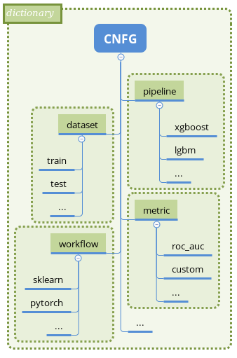

Concepts
========

.. contents:: **Contents**
    :depth: 2
    :local:
    :backlinks: none

Mlshell structure based on `Pycnfg <https://pycnfg.readthedocs.io/en/latest/>`_ library.
All parameters set from single configuration - Python dictionary. Execution
could be controlled in a script/notebook either with :func:`pycnfg.run` ,
or low-level :class:`pycnfg.Handler` . Sub-configurations in each sub-section
describes initial state and steps to produce target object.

ML task configuration usually contains following main sections:

* path - set project path.
* logger - make logger.
* pipeline - create/load model.
* dataset - load from db.
* metric - specify scorers.
* workflow - fit/predict pipelines on datasets and optimize/validate metrics.

Configurations executied in priority:

project path >> logger >> pipeline, dataset, metric >> workflow

MLshell implements unified object interface for main sections and corresponding
``producer`` classes for object createion. All classes have high level of
abstraction and encapsulation to provide extension with minimal code changes.
See detailed description below.

See `Examples. <Examples.html>`_

.. note::
    Arbitrary objects could be pre-accommodated in :func:`pycnfg.run`, so no
    need to always specify objects via configurations.

    Each produce inherits from :class:`pycnfg.Producer` , that includes
    load_cache/dump_cache methods to load/dump intermediate object state.
    The producers methods can be extended/rewrote either explicit in source
    or through `patch` key in configuration. In most cases default
    implementation will be sufficient.

    Pycnfg configuration allows to set decorators for any step. It could be
    usefull for time/memory profiling and checking parameter consistence.
    For example built-in :func:`mlshell.decorator.checker` print:

        * objects hash alteration.
        * numpy errors.

Sections
^^^^^^^^

Path
----

Set string path to project directory or :func:`pycnfg.find_path` could be used
to auto-detect path.

Section example:

.. code-block:: python

    import pycnfg

    'path': {
        'default': {
            'init': pycnfg.find_path,
            'producer': pycnfg.Producer,
            'priority': 1,
            'steps': [],
        }
        # Alternative.
        'my_path': {
            'init': '/home/user/project',
            'producer': pycnfg.Producer,
            'priority': 1,
            'steps': [],
        },
    }

Logger
------

Set string name in ``init`` and use :class:`mlshell.LoggerProducer` to create
logger.

:func:`mlshell.LoggerProducer.make` makes logger via :func:`logging.config.dictConfig` .
See default logger configuration :data:`mlshell.LOGGER_CONFIG` for details.

.. see `logger configuration <_modules/mlshell/logger.html>`_ for details.

Section example:

.. code-block:: python

    import pycnfg
    import logging

    'logger': {
        'default': {
            'init': 'default',
            'producer': mlshell.LoggerProducer,
            'priority': 2,
            'steps': [
                ('make',),
            ],
        }
        # Alternative.
        'my_logger': {
            'init': logging.getLogger('my_logger') ,
            'producer': pycnfg.Producer,
            'priority': 2,
            'steps': [],
        },
    }

Pipeline
--------

:class:`mlshell.Pipeline` implements interface to access arbitrary pipeline.
All sklearn based pipelines supported from the box. For others, adaptation in
compliance with interface needed.

:class:`mlshell.PipelineProducer` executes steps on pipeline.

- :meth:`mlshell.PipelineProducer.load` loads existed model from IO.
- :meth:`mlshell.PipelineProducer.info` logs model info.
- :meth:`mlshell.PipelineProducer.make` creates pipeline from steps via :class:`sklearn.pipeline.Pipeline` .

    - Any pypeline parameter(hp) can be tuned in GS.
    - Stable cross-validation scheme prevents data leaks.

By default unified steps embedded for broad range of ml tasks :class:`mlshell.pipeline.Steps` :

.. code-block:: none

    default_steps = [
        ('pass_custom',      Pass custom params to scorer while grid search.)
        ('select_rows',      Delete rows (outliers/anomalies).)
        ('process_parallel',
            ('pipeline_categoric',
               ('select_columns',      Select categorical & binary sub-columns.)
               ('encode_onehot',       OneHot encoder.)
            )
            ('pipeline_numeric',
                ('select_columns',     Select numeric sub-columns.)
                ('impute',
                    ('indicators',     Impute indicators.)
                    ('gaps',           Impute gaps.)
                )
                ('transform_normal',   Yeo-Johnson features transformation.)
                ('scale_row_wise',     Row-wise transformation.)
                ('scale_column_wise',  Column-wise transformation.)
                ('add_polynomial',     Add polynomial features.)
                ('compose_columns',
                    ("discretize",     Discretize columns.)
                )
            )
        )
        ('select_columns',   Model-wise feature selection.)
        ('reduce_dimension', Factor analyze feature selection/transformation.)
        ('estimate',         Target estimation.)
    ]

- For regressor ``estimate`` step supports target transformation:
 :class:`sklearn.compose.TransformedTargetRegressor` .
- | For classifier ``estimate`` step supports two-stage meta-estimator to predict
  | probabilities and apply classification threshold.

    - ('predict_proba', :class:`mlshell.model_selection.PredictionTransformer` ),
    - ('apply_threshold', :class:`mlshell.model_selection.ThresholdClassifier` ),

Section example:

.. code-block:: python

    import pycnfg
    import lightgbm

    'pipeline': {
        'my_pipe': {
            'init': mlshell.Pipeline,
            'producer': mlshell.PipelineProducer,
            'priority': 3,
            'steps': [
                ('make', {
                    'estimator_type': 'regressor',
                    'estimator': lightgbm.LGBMRegressor()
                    }),
            ],
        },
    }
.. .. `Examples <Concepts.html#Advanced#resolver>`_
.. .. `mlshell.Pipeline <_pythonapi/mlshell.producers.pipeline.html#mlshell.producers.pipeline.Pipeline>`_
.. .. `mlshell.PipelineProducer <_pythonapi/mlshell.producers.pipeline.PipelineProducer.html#mlshell.producers.pipeline.PipelineProducer>`_.
.. See `CreateDefaultPipeline <_modules/mlshell/default.html#CreateDefaultPipeline>`_ source for details.
.. .. note::

Dataset
-------

:class:`mlshell.Dataset` implements interface to access arbitrary dataset.
Implemented as dictionary with some additional attributes and methods.

:class:`mlshell.DatasetProducer` executes steps on dataset.

- :func:`mlshell.DatasetProducer.load` loads raw data from IO (csv imlemented).
- :func:`mlshell.DatasetProducer.info` logs dataset info.
- :func:`mlshell.DatasetProducer.split` splits dataset on test and train.
- :func:`mlshell.DatasetProducer.preprocess` preprocesses raw data to final state.

    - Categorical features are Ordinal encoded.
    - Categorical gaps are imputed with fillna(value='unknown').
    - Mumeric gaps are imputed with fillna(value= ``numpy.nan`` ).
    - Features casted to ``numpy.float64`` .

Section example:

.. code-block:: python

    import pycnfg

    'dataset': {
        'my_data': {
            'init': mlshell.Dataset,
            'producer': mlshell.DatasetProducer,
            'priority': 3,
            'steps': [
                ('load', {'filepath': 'data/train.csv',}),
                ('preprocess', {
                    'targets_names': ['loss'],
                    'categor_names': [f'cat{i}' for i in range(1, 117)],
                    }),
                ('split', {'train_size': 0.7, 'shuffle': False}),
            ],
        },
    }

Metric
------

:class:`mlshell.Metric` implements interface to access arbitrary scorer.
Extended :term:`sklearn:scorer` .

:class:`mlshell.MetricProducer` executes steps on scorer.

:func:`mlshell.MetricProducer.make` make scorer from callable.
Extended :func:`sklearn.metrics.make_scorer` .

Section example:

.. code-block:: python

    import pycnfg

    'metric': {
        'my_score': {
            'init': mlshell.Metric,
            'producer': mlshell.MetricProducer,
            'priority': 3,
            'steps': [
                ('make', {
                    'score_func': sklearn.metrics.r2_score,
                    'greater_is_better': True
                    }),
            ],
        }
    }

Workflow
--------

Initial section object set to :class:`dict` .

:class:`mlshell.Workflow` executes steps and writes results to dictionary.

- :func:`mlshell.Workflow.fit` fit pipeline.
- :func:`mlshell.Workflow.optimize` optimize pipeline.
- :func:`mlshell.Workflow.validate` make and score prediction.
- :func:`mlshell.Workflow.predict` make and dump prediction.
- :func:`mlshell.Workflow.plot` plot results.
- :func:`mlshell.Workflow.dump` dump pipeline.

Each method (except dump) includes ``subset`` argument to specify part of
dataset to apply on. Typically:

- fit/optimize pipeline with CV on train/train subset.
- validate on postponed train subset.
- predict on test.

Section example:

.. code-block:: python

    import pycnfg

    'workflow': {
        'my_flow': {
            'init': {},
            'producer': mlshell.Workflow,
            'priority': 4,
            'global': {
                'pipeline_id': 'pipeline__my_pipe',
                'dataset_id': 'dataset__my_data',
                'metric_id': ['metric__my_score'],
                'hp_grid': {
                    'estimate__regressor__n_estimators': np.linspace(50, 1000, 10, dtype=int),
                },
            },
            'steps': [
                ('optimize', ),
                ('validate', ),
                ('predict', ),
                ('dump', ),
            ],
        },
    }

Hyperparameters
~~~~~~~~~~~~~~~

Any pipeline parameter ``hp`` can be optimized in grid search.

- | :func:`mlshell.Workflow.fit` awaits for ``hp`` argument to update pipeline
  | parameters before fitting. If parameters range provided, zero position will
  | be used.

- | :func:`mlshell.Workflow.optimize` awaits for ``hp_grid`` argument to set
  | pipeline parameters range before optimizing.

``hp_grid`` example for pipeline created from :class:`mlshell.pipeline.Steps` :

.. code-block:: python

    hp_grid = {
        # custom metric(s) param
        'pass_custom__kw_args': [{'metric__id': {'param_a': 1, 'param_b': 'c'}},
                                 {'metric__id': {'param_a': 2, 'param_b': 'd'}}],
        # transformers param
        'select_rows__kw_args': [{}],
        'process_parallel__pipeline_numeric__impute__gaps__strategy': ['constant'],
        'process_parallel__pipeline_numeric__transform_normal__skip': [True],
        'process_parallel__pipeline_numeric__scale_column_wise__quantile_range': [(1, 100)],
        'process_parallel__pipeline_numeric__add_polynomial__degree': [3],
        'process_parallel__pipeline_numeric__compose_columns__discretize__n_bins': [5],
        'select_columns__estimator__skip': [True],
        'reduce_dimension__skip': [True],
        # regressor only
        'estimate__transformer': [None, sklearn.preprocessing.FunctionTransformer(func=np.log, inverse_func=np.exp)],
        # estimator params
        'estimate__regressor__n_estimators': np.linspace(50, 500, 10, dtype=int),
        'estimate__regressor__num_leaves' :[2 ** i for i in range(1, 6 + 1)],
        'estimate__regressor__max_depth': np.linspace(1, 10, 10, dtype=int),
        # classifier only
        'estimate__apply_threshold__threshold': [0.1],
        'estimate__predict_proba__classifier__min_child_samples': np.linspace(1, 100, 10, dtype=int),
    }

.. note::

    Probaility distribution for ``hp_grid`` params are also possible, it should
    supports .rvs() sampling method.

    It is possible to rotate last step estimator (alternative to multiple
    pipeline configurations):

    .. code-block::

        hp_grid = {
            'estimate__regressor': [
                sklearn.linear_model.SGDRegressor(penalty='elasticnet', l1_ratio=1,
                                                  shuffle=False, max_iter=1000,
                                                  alpha=0.02),
                lightgbm.LGBMRegressor(num_leaves=2, min_data_in_leaf=60,
                                       n_estimators=200, max_depth=-1),
            ]
        }

Resolver
~~~~~~~~
Some parameters like categoric/numeric indices depend on specific dataset,
they need resolving before pipeline fitting. For that case, 'auto'/['auto'] can
be set in parameters (``hp`` or ``hp_grid``), that will trigger hp value
resolution according to :class:`mlshell.model_selection.Resolver` .
If ['auto'], parameter will be substituted with ['resolved value'].

.. note::

    Default resolver supports classification threshold range resolution from
    ROC curve on OOF prediction :func:`mlshell.model_selection.Resolver.th_resolver` .
    See also `Classification threshold <Concepts.html#classifier-threshold>`_  below.

Optimizer
~~~~~~~~~

:class:`mlshell.model_selection.Optimizer` proposes unified interface to use
arbitrary optimizers. Intended to be used in . For new optimizer formats no
need to edit :class:`mlshell.Workflow` class, just adapt ``Optimizer`` in
compliance to interface.

:class:`mlshell.model_selection.RandomizedSearchOptimizer` contains
implementation for :class:`sklearn.model_selection.RandomizedSearchCV` .

:class:`mlshell.model_selection.MockOptimizer` contains implementation
to efficient brute force prediction-related parameters as separate optimize
step. For example: classification threshold or score function kwargs don`t need
whole pipeline refit to probe.

:class:`mlshell.Workflow` supports multi-stage optimization, for any pipeline-dataset pair
hyper-parameters could be tuned step-wise with different optimizers.
Pipeline in ``objects`` auto updated to the best estimator find
before for the current dataset. See :meth:`mlshell.model_selection.Optimizer.update_best`
for stage merging logic.

*scorer kwargs*
"""""""""""""""

Pipeline step ``pass_custom__kw_args`` allows to pass arbitrary parameters to
scorer function while grid search (as if there was additional nested loop).
Scorer should be made with ``needs_custom_kw_args=True`` flag and supports
corresponding kwargs. Efficient :class:`mlshell.model_selection.MockOptimizer` could be used.

.. code-block:: python

    def custom_score_metric(y_true, y_pred, **kwargs):
        """Custom precision metric."""
        if kwargs:
            # some logic depends on kwargs.
            pass
        tp = np.count_nonzero((y_true == 1) & (y_pred == 1))
        fp = np.count_nonzero((y_true == 0) & (y_pred == 1))
        score = tp/(fp+tp) if tp+fp != 0 else 0
    return score

*classifier threshold*
""""""""""""""""""""""

For classification task it is possible to tune classification threshold
``th_`` on CV. If positive class probability ``P(positive label) = 1 - sum(P(negative label)) > th_``
for some sample, classifier set positive label for this sample,
otherwise negative label with max probability.

Set last pipeline step to:

.. code-block:: python

    step = sklearn.pipeline.Pipeline([
        ('estimate', sklearn.pipeline.Pipeline([
            ('predict_proba', :class:`mlshell.model_selection.PredictionTransformer` (estimator)),
            ('apply_threshold', :class:`mlshell.model_selection.ThresholdClassifier` (threshold)),
        ]))
    ])

.. note::

    Mlshell supports multiple strategy for ``th_`` tuning:

    (0) Not use ``th_``.

        * Not all classifiers provide predict_proba (SVM).
        * Use f1, logloss metrics.

    (1) One-stage optimization.

        * Tune ``th_`` on a par with other hps.

    (2) Multi-stage optimization.

        First optimizer hps, then ``th_`` separately.

        * For hps stage use for example auc-roc score.
        * For ``th_`` stage use original score function.
        Efficient :class:`mlshell.model_selection.MockOptimizer` could be used.

    For (1)/(2) ``th_`` search range should be known in advance:

        * Either set arbitrary range in ``hp_grid``.
        {'estimate__apply_threshold__threshold': [val,] }

        * Or set 'auto'/['auto'] in ``hp_grid`` to resolve typical values from ROC curve on OOF probabilities predictions.
        Note, will be used default hps in case (1), best on previous stage hps in case (2).
        {'estimate__apply_threshold__threshold': 'auto'}

``th_`` range extracted from ROC curve example:

.. image:: ./_static/images/th_.png
  :width: 1000
  :alt: error

Validator
~~~~~~~~~

:class:`mlshell.model_selection.Validator` proposes unified interface to
validate pipeline on scorers. Intended to be used in :class:`mlshell.Workflow`.
For new pipeline/metric interface, just adapt 'Validator' in compliance to
interface, so no need to edit `Workflow` class

Plotter
~~~~~~~

:class:`mlshell.plot.Plotter` proposes unified interface to plot results.

*gui*
"""""

Mlshell provides gui based on :mod:`matplotlib.widgets` .

For small dataset it is reasonable to visualize vectorized score per samples.
Sliders for hyper-parameters are available. Model retrained and make predict on
slider change.

.. note::
    Scorer ``score_func_vector`` should be available to plot vectorized score.

Results
^^^^^^^

:func:`pycnfg.run` returns ``objects`` dictionary, containing resulted objects
for all executed configurations. Each pipeline is fitted corresponding to last fit/optimize method.

Each optimization stage produces ``<timestamp>_runs.csv`` file. See
:meth:`mlshell.model_selection.Optimizer.dump_runs` for details.

``*_runs.csv`` files could be merged in dataframe for further analyse:

.. code-block:: python

    import glob

    files = sorted(glob.glob(f"project/results/runs/*_runs.csv"))
    df_lis = list(range(len(files)))
    for i, f in enumerate(files):
        try:
            df_lis[i] = pd.read_csv(f, sep=",", header=0)
            print('Read runs.csv\n', f, df_lis[i].shape,
                  df_lis[i]['dataset__id'][0], df_lis[i]['pipeline__id'][0])
        except Exception as e:
            print(e)
            continue
    df = pd.concat(df_lis, axis=0, sort=False).reset_index()

    # groupby data hash
    df.groupby('dataset__hash').size()
    # groupby estimator
    df.groupby('pipeline__hash').size()

Project structure
^^^^^^^^^^^^^^^^^

It is convenient to follow the structure:

.. code-block:: none

    |_project/
        ** input **
        |__ conf.py
        |__ run.py
        |__ EDA.ipynb
        |__ data/
            ~~ could be remote db ~~
            |__ train.csv
            |__ test.csv
        ** output autogenerated **
        |__ results/
            |__ models/
                ~~ dump fitted models and predictions ~~
                |__ <id>.model
                |__ <id>_pred.csv
            |__ runs/
                ~~ dump all GS runs result ~~
                |__ <timestamp>_runs.csv
            |__ <logger_name>_logs/
                ~~ script logs ~~
                |__ <logger_name>_<logger_level>.log
            |__ ipython_logs/
                ~~ notebook logs ~~
                |__ <logger_name>_<logger_level>.log
            |__ .temp/
                ~~ cache ~~
                |__ objects/
                    ~~ cache for producer objects ~~
                |__ pipeline/
                    ~~ cache for sklearn.pipeline.Pipeline(memory=<./.temp/pipeline>) ~~
