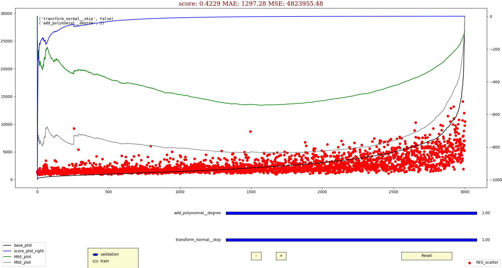
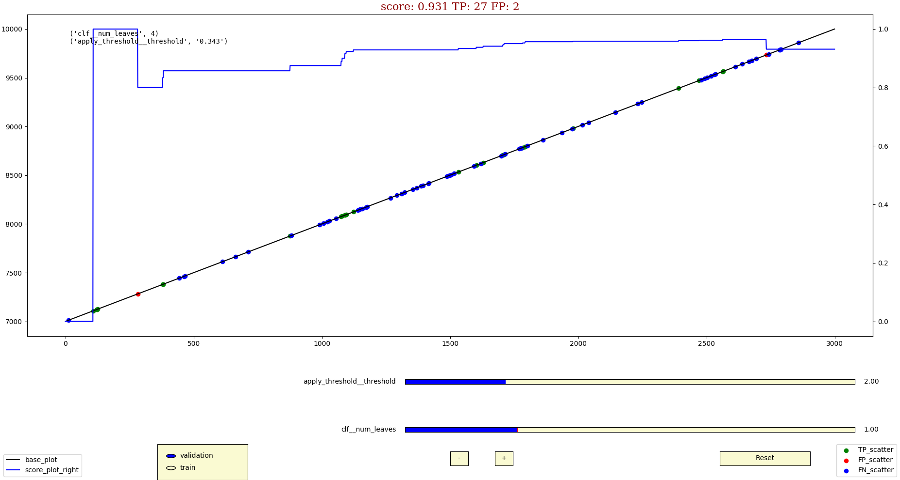

Examples
========

.. contents:: **Contents**
    :depth: 1
    :local:
    :backlinks: none

Regression
~~~~~~~~~~
`"Allstate claims severity" dataset <https://www.kaggle.com/c/allstate-claims-severity>`_

:github:`github repo </examples/regression>`

**Grid search**
^^^^^^^^^^^^^^^

try different ideas:

* estimator: linear vs lightgbm vs xgboost.
* features 'yeo-johnson' transformation.
* features quantile scaler.
* polynomial feature generation: degree 2 vs 3.
* target transformer: None vs np.log vs y**0.25.
* loss: mse vs mae vs `ln(cosh(x)) <https://www.kaggle.com/c/allstate-claims-severity/discussion/24520>`_.
* estimator hyperparameters.

If time is limited:

    * use subset of data (`rows_limit` and `random_skip` implemented in classes.GetData example)
    * use greedy approach:

        * find approximately reasonable estimator` hps.
        * try ideas.
        * for the best refine estimator hps.

**Example conf.py**
^^^^^^^^^^^^^^^^^^^

* use ``target_transformer`` instead of default.
* GS ``add_polynomial__degree`` and ``transform_normal__skip``.
* 10000 rows subset of data.

.. https://docutils.sourceforge.io/docs/ref/rst/directives.html#including-an-external-document-fragment
.. literalinclude:: /../../examples/regression/conf.py
   :language: python
   :linenos:

.. .. code-block:: python

**Results**
^^^^^^^^^^^

**``info`` logs**

.. include:: ./_static/text/regressor_run_info.log
   :literal:

**``minimal`` logs**

.. include:: ./_static/text/regressor_run_minimal.log
   :literal:

**gui**

base_plot is sorted target

Classification
~~~~~~~~~~~~~~
`"IEEE fraud detection" dataset <https://www.kaggle.com/c/ieee-fraud-detection>`_

:github:`github repo </examples/classification>`

**Grid search**
^^^^^^^^^^^^^^^

try different ideas:

  * estimators.
  * splitters.
  * hps.

If time is limited:

    * use subset of data (`rows_limit` and `random_skip` implemented in classes.GetData examples)
    * use greedy approach:

        * find approximately reasonable estimator` hps.
        * try ideas.
        * for the best refine estimator hps.

**Example conf.py**
^^^^^^^^^^^^^^^^^^^

* GS ``estimate__classifier__num_leaves``.
* 10000 rows subset of data.

.. literalinclude:: /../../examples/classification/conf.py
   :language: python
   :linenos:

.. .. code-block:: python

**Results**
^^^^^^^^^^^

**``info`` logs**

.. include:: ./_static/text/classifier_th_0_run_info.log
   :literal:

For demonstrative purpose, set ``th_strategy`` to ``1``/``3``,
so additional grid search CV for threshold applied:

.. include:: ./_static/text/classifier_th_1_run_info.log
   :literal:
   :start-line: 120

As you can see,

- main ``score`` value (roc-auc) not depends on threshold values as expected (evaluates on predict_proba).
- precision/custom precision depends on threshold.

If positive class ``th_`` close to 1, all samples classified as negative class (TP=0 and FP=0),
so precision become ill-defined, score set to 0 as specified in 'zero_division' argument in ``metrics``.

- gs ignore other metrics and select best run where main is maximum  (first  occurrence in that case).

Threshold gridsearch is reasonable only for threshold-dependent metrics.

- ``th_`` range came from roc_curve on OOF prediction.

You can set number of poins ``th_points_number`` and trig plot roc_curve with ``th_plot_flag`` in conf.py.

.. image:: ./_static/images/th_.png
  :width: 1000
  :alt: error

see `Concepts: Classification threshold <Concepts.html#classification-threshold>`_ for details.

**gui**

base_plot is diagonal line

see `Concepts: Results <Concepts.html#gui>`_ for details.

